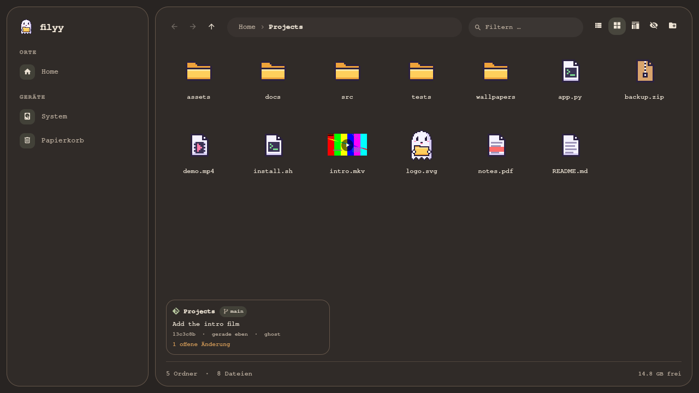

<p align="center"></p>

# Filyy

A pixel-ghost file manager for Hyprland in the look of Ghostly QShell, my Quickshell desktop.
PySide6 + QML, a real window with its own app id (`filyy`), no shell integration needed.



## Features

**Look and feel**
- Follows the shell theme live: colours, corner radius, fonts, terminal and "reduce motion" come from
  Ghostly QShell's `preferences.ini`; without the shell a neutral grey theme is used.
- Motion from the shell's settings panel: 220 ms fade with a hint of scale, pages settle 8 px upward,
  the places rail selection glides on a spring.
- Hand-set pixel icons for file types, drawn by `tools/pixelart.py` in one palette.
- A living ghost: it floats and blinks, lifts its folder while copying, and gets sad in empty folders.
- Tiling friendly: the layout folds down when Hyprland tiles it narrow.

**Getting around**
- Tabs and split view (F3), each pane with its own history, selection and view.
- Fuzzy jump to any folder (Ctrl+K), ranked by how often and how recently you went there.
- Content search through ripgrep (Ctrl+Shift+F), streamed and grouped by file.
- Quick look on the space bar: images, PDFs page by page, video and audio, code with highlighting.
- A small git card inside repositories: branch, last commit and whether anything is uncommitted.
- Storage map (Ctrl+3): what takes the space, as bars, measured like `du`.
- Archives as folders: zip/jar and tar (gz, bz2, xz, zst) browse like directories.

**Working with files**
- Copy and move as jobs with progress, pause, cancel and a conflict dialog (skip, replace, keep both).
- Undo (Ctrl+Z) for copy, move, duplicate, replace, rename, new folder, trash, restore and extract.
- Batch rename with live preview: find/replace (regex), `{name} {n} {date} {ext}` templates, kebab-case.
- The trash as a graveyard of pixel tombstones: restore, delete for good, empty.
- Open with … any installed app, optionally as the new default.
- Video thumbnails through ffmpeg in the shared freedesktop thumbnail cache.
- Clipboard and drag and drop work with Dolphin, Nautilus and other apps.

The UI is in German.

## Install

```sh
./install.sh      # builds nosuspend.c, links ~/.local/bin/filyy, the desktop entry and the icon
filyy [folder or archive]
```

Bind it in Hyprland, e.g. `hl.bind(mainMod .. " + E", hl.dsp.exec_cmd("filyy"))`.
Point it at another shell config with `FILYY_SHELL=<dir>`.

Required: `pyside6` (system Qt 6 with Qt Multimedia and Qt PDF), a C compiler with the Wayland client
headers, `gio` and `xdg-mime` (glib, xdg-utils), and a Nerd Font (Monofur Nerd Font) for the icons.
Optional: `rg` for content search, `ffmpeg`/`ffprobe` for video thumbnails, `git` for the git card,
Pillow for EXIF dates in batch rename. Each feature just switches off when its tool is missing.

## Keys

| Key | Action |
| --- | --- |
| ↑ ↓ (← → in grid), Home/End, PgUp/PgDn | move, with Shift to extend the selection |
| Enter, double click | open (archives open like folders) |
| Space | quick look, ← → step through the folder |
| Backspace, Alt+↑ / Alt+← → | up / history |
| typing, Ctrl+F | filter |
| Ctrl+K | jump to a folder |
| Ctrl+Shift+F | search file contents |
| Ctrl+L, click the path bar | type a path (`~` works) |
| Ctrl+T / Ctrl+W, Ctrl+Tab, middle click | new / close tab, next tab, folder in new tab |
| F3, F6 | split view, switch side |
| Ctrl+C / X / V | copy / cut / paste |
| Ctrl+D, F2 | duplicate, rename (several selected: batch rename) |
| Ctrl+Z | undo |
| Del, Shift+Del | move to trash, delete permanently (both ask first) |
| Ctrl+Shift+N, F10 | new folder |
| Ctrl+H, Ctrl+1/2/3, F5 | hidden files, list/grid/storage map, reload |
| Shift+F4 | terminal here |
| right click, Menu key | context menu |

## Data it keeps

- `$XDG_DATA_HOME/filyy/frecency.json`: folder visits for Ctrl+K.
- `$XDG_CACHE_HOME/thumbnails/large/`: video thumbnails (the standard shared cache).
- `$XDG_CACHE_HOME/filyy/open/`: files opened from inside archives.
- The trash is the standard freedesktop home trash.

## Why there is a C file

Hyprland 0.56 sometimes sends `xdg_toplevel.suspended` to a window that is visible and active, for
example after dragging it from a large tile into a smaller one. Qt obeys and stops drawing, so Hyprland
stretches the last frame into the new size. `nosuspend.c` is preloaded into Filyy only and advertises
`xdg_wm_base` as version 5, where `suspended` does not exist yet. Filyy drops it from its environment right
after start, so apps opened from Filyy do not inherit it.

## Checks

```sh
python3 tests/test_core.py   # listing, jobs, trash, undo, jump, rename, git, apps, thumbnails, search, usage, archives
node tests/util.js           # history, breadcrumbs, sizes
python3 tools/pixelart.py    # regenerates every pixel graphic
```

## Licence

MIT, see [LICENSE](LICENSE). Everything Filyy ships is its own: code, pixel art and the tombstone.
It uses, without bundling them: Qt and PySide6 (LGPL-3.0), Qt Multimedia and Qt PDF (LGPL-3.0),
ripgrep (MIT/Unlicense), Pillow (MIT-CMU), and runs ffmpeg (LGPL/GPL), git (GPL-2.0), gio (LGPL-2.1)
and xdg-mime (MIT) as separate programs. Icons in the UI come from the Nerd Font installed on the system.
